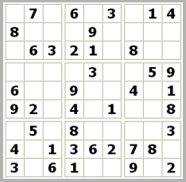
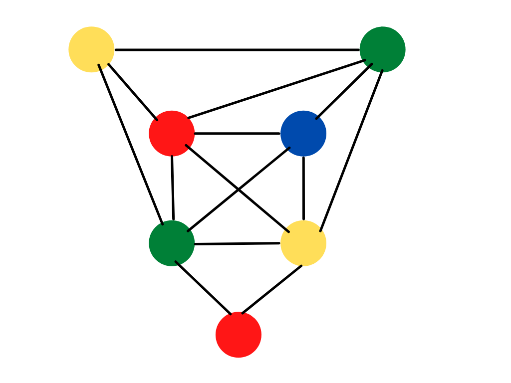

# Rapport TME 5 et 6 - IAMSI

Membres du binôme :
- KRISNI Almehdi
- ARICHANDRA Santhos

### **Exercice 1 - Premiers pas en ASP**

Afin de se familiariser avec l'environnement de Clingo, on réalise quelques tests sur les différents programmes fournis par l'énoncé du TME.
On affiche le ou les ensembles-réponses (answer sets) de chaque programme.

Programme 1 :
* conges temps_libre sortie_cine

Programme 2 :
* q

Programme 3 :
* p r
* q r

Programme 4 :
* p r

D'après Clingo, tous les programmes sont satisfiables et disposent donc d'au moins un answer set.

### **Exercice 2 - Problème des 8-reines**

Le jeu des reines consiste à placer 8 reines sur un plateau de jeu de 8x8 cases, et une reine par colonne.
Il existe différentes contraintes au sein du jeu puisqu'il est interdit de placer 2 reines sur la même ligne, colonne ou diagonale.

On écrit toutes ces contraintes dans le fichier 'Exercice2/reines.lp' puis on tente de résoudre le programme grâce à Clingo.

Une des solutions réalisable est :
valideReine(1) valideReine(2) valideReine(3) valideReine(4) valideReine(5) valideReine(6) valideReine(7) valideReine(8) 
reine(1,3) reine(2,5) reine(3,8) reine(4,4) reine(5,1) reine(6,7) reine(7,2) reine(8,6)

Le prédicat reine(X, Y) signifique qu'une reine se trouve à la position (X, Y) dans la solution et le prédicat valideReine(X) signifie que la reine de la colonne X a été placée sur l'échiquier.

On essaye maintenant de trouver une solution au jeu avec une reine forcément placée sur la case (1,1). On doit donc ajouter au système le prédicat reine(1, 1) et l'exécuter avec Clingo.
On obtient alors 4 solutions au problème. On affiche uniquement les prédicats 'reine' de la solution afin de faciliter la compréhension.
Les solutions obtenues sont :
* reine(1,1) reine(2,7) reine(3,5) reine(4,8) reine(5,2) reine(6,4) reine(7,6) reine(8,3)
* reine(1,1) reine(2,6) reine(3,8) reine(4,3) reine(5,7) reine(6,4) reine(7,2) reine(8,5)
* reine(1,1) reine(2,5) reine(3,8) reine(4,6) reine(5,3) reine(6,7) reine(7,2) reine(8,4)
* reine(1,1) reine(2,7) reine(3,4) reine(4,6) reine(5,8) reine(6,2) reine(7,5) reine(8,3)

### **Exercice 3 - Résolveur de Sudoku**

Le jeu du Sudoku consiste à placer dans une grille, divisée en 9 sous-grilles distinctes, des chiffres allant de 1 à 9 jusqu'à remplir la grille entièrement.  Les règles du jeu sont simples : chaque ligne, chaque colonne et chaque sous-grille ne doit contenir qu'une seule fois tous les chiffres de 1 à 9.

On commence par créer l'ensemble des valeurs possibles et des positions possibles avec les prédicats suivants :
- valeur(1..9) allant créer tous les chiffres
- pos(0..8) allant créer toutes les positions en X et Y possible
- case(X, Y, Z) signifiant qu'à la case (X, Y), on retrouve le chiffre Z

On nous demande dans un premier temps de générer l'ensemble des plateaux possibles. On peut les générer grâce à la règle suivante :
 1 {case(X, Y, Z) : valeur(Z)} 1 :- pos(X), pos(Y).

On obtient alors plus de 400 modèles en 10 secondes de résolution (interruption forcée). Une de ces solutions réalisables est (l'affichage est réalisé par colonnes.)
- valeur(1) valeur(2) valeur(3) valeur(4) valeur(5) valeur(6) valeur(7) valeur(8) valeur(9) 
- pos(0) pos(1) pos(2) pos(3) pos(4) pos(5) pos(6) pos(7) pos(8) 
- case(0,0,9) case(1,0,3) case(2,0,3) case(3,0,9) case(4,0,5) case(5,0,6) case(6,0,6) case(7,0,6) case(8,0,6) 
- case(0,1,6) case(1,1,3) case(2,1,3) case(3,1,3) case(4,1,3) case(5,1,3) case(6,1,7) case(7,1,9) case(8,1,7) 
- case(0,2,7) case(1,2,7) case(2,2,3) case(3,2,3) case(4,2,3) case(5,2,3) case(6,2,3) case(7,2,3) case(8,2,3) 
- case(0,3,3) case(1,3,3) case(2,3,3) case(3,3,3) case(4,3,9) case(5,3,9) case(6,3,9) case(7,3,5) case(8,3,9) 
- case(0,4,5) case(1,4,5) case(2,4,9) case(3,4,5) case(4,4,3) case(5,4,3) case(6,4,3) case(7,4,3) case(8,4,3) 
- case(0,5,3) case(1,5,3) case(2,5,3) case(3,5,3) case(4,5,3) case(5,5,3) case(6,5,3) case(7,5,3) case(8,5,3) 
- case(0,6,3) case(1,6,3) case(2,6,3) case(3,6,3) case(4,6,3) case(5,6,3) case(6,6,3) case(7,6,3) case(8,6,3) 
- case(0,7,3) case(1,7,6) case(2,7,6) case(3,7,3) case(4,7,8) case(5,7,5) case(6,7,3) case(7,7,4) case(8,7,7) 
- case(0,8,5) case(1,8,7) case(2,8,8) case(3,8,6) case(4,8,5) case(5,8,4) case(6,8,3) case(7,8,6) case(8,8,3)

On peut ajouter des contraintes, comme par exemple la case(0,1) devant contenir la valeur 7 et la case (1,0) la valeur 8. On obtient alors une solution :
- case(1,0,8) case(0,1,7) *(les contraintes)*
- case(0,0,9) case(2,0,3) case(3,0,3) case(4,0,9) case(5,0,5) case(6,0,6) case(7,0,6) case(8,0,6) 
- case(1,1,6) case(2,1,8) case(3,1,3) case(4,1,3) case(5,1,3) case(6,1,3) case(7,1,3) case(8,1,7) 
- case(0,2,7) case(1,2,7) case(2,2,5) case(3,2,5) case(4,2,3) case(5,2,3) case(6,2,3) case(7,2,3) case(8,2,3) 
- case(0,3,3) case(1,3,3) case(2,3,3) case(3,3,3) case(4,3,3) case(5,3,9) case(6,3,5) case(7,3,9) case(8,3,5) 
- case(0,4,9) case(1,4,5) case(2,4,5) case(3,4,9) case(4,4,5) case(5,4,3) case(6,4,3) case(7,4,3) case(8,4,3) 
- case(0,5,3) case(1,5,3) case(2,5,3) case(3,5,3) case(4,5,3) case(5,5,3) case(6,5,3) case(7,5,3) case(8,5,3) 
- case(0,6,3) case(1,6,3) case(2,6,3) case(3,6,3) case(4,6,3) case(5,6,3) case(6,6,3) case(7,6,3) case(8,6,3) 
- case(0,7,6) case(1,7,6) case(2,7,7) case(3,7,7) case(4,7,7) case(5,7,3) case(6,7,5) case(7,7,8) case(8,7,7) 
- case(0,8,5) case(1,8,7) case(2,8,8) case(3,8,6) case(4,8,5) case(5,8,4) case(6,8,3) case(7,8,6) case(8,8,3)

On commence désormais à reproduire les contraintes du jeu. La première règle stipule qu'on ne peut pas retrouver 2 fois le même chiffre sur la même ligne. On ajoute la règle :
 :- case(X, Y, Z), case(X, YY, Z), Y != YY, pos(X), pos(Y), pos(YY), valeur(Z).

La seconde règle stipule qu'on ne peut pas retrouver 2 fois le même chiffre sur la même colonne. On ajoute la règle :
 :- case(X, Y, Z), case(XX, Y, Z), X != XX, pos(X), pos(XX), pos(Y), valeur(Z).

La troisième règle stipule qu'on ne peut pas retrouver 2 fois le même chiffre dans la même sous-grille. Une sous-grille est un ensemble de 3x3 cases. On peut savoir savoir si 2 cases dans la même sous_grille si les valeurs entières des divisions par 3 de leurs positions sont égales. On ajoute la règle :
 :- case(X,Y,Z), case(XX, YY, Z), X/3 == XX/3, Y/3 == YY/3, X!= XX, Y != YY, pos(X), pos(XX), pos(Y), pos(YY), valeur(Z).

En ajoutant ces 3 contraintes, on obtient une solution :

La grille proposée par le TME est la suivante : 

On cherche alors à la résoudre grâce au résolveur en ajoutant comme contraintes les cases déjà remplies. On obtient le remplissage suivant :
- case(0,1,7) case(0,3,6) case(0,5,3) case(0,7,1) case(0,8,4) case(1,0,8) case(1,4,9) case(2,1,6) case(2,2,3) case(2,3,2) case(2,4,1) case(2,6,8) case(3,4,3) case(3,7,5) case(3,8,9) case(4,0,6) case(4,3,9) case(4,6,4) case(4,8,1) case(5,0,9) case(5,1,2) case(5,3,4) case(5,5,1) case(5,8,8) case(6,1,5) case(6,3,8) case(6,8,3) case(7,0,4) case(7,2,1) case(7,3,3) case(7,4,6) case(7,5,2) case(7,6,7) case(7,7,8) case(8,0,3) case(8,2,6) case(8,3,1) case(8,6,9) case(8,8,2) **(case pré-remplies)**
- valeur(1) valeur(2) valeur(3) valeur(4) valeur(5) valeur(6) valeur(7) valeur(8) valeur(9) 
- pos(0) pos(1) pos(2) pos(3) pos(4) pos(5) pos(6) pos(7) pos(8) 
- case(1,1,1) case(3,0,1) case(6,6,1) case(0,0,2) case(1,7,2) case(3,6,2) case(4,4,2) case(6,2,2) case(1,6,3) case(4,1,3) case(5,7,3) case(1,2,4) case(2,5,4) case(3,1,4) case(6,4,4) case(8,7,4) case(0,6,5) case(1,3,5) case(2,0,5) case(4,2,5) case(5,4,5) case(7,8,5) case(8,5,5) case(1,8,6) case(3,5,6) case(5,6,6) case(6,7,6) case(1,5,7) case(2,8,7) case(3,3,7) case(4,7,7) case(5,2,7) case(6,0,7) case(8,4,7) case(0,4,8) case(3,2,8) case(4,5,8) case(8,1,8) case(0,2,9) case(2,7,9) case(6,5,9) case(7,1,9) **(case remplies par le résolveur)**

Ce remplissage correspond visuellement à la grille (générée sur le site *https://sudoku9x9.com/smartsolver.php*) : 

### **Exercice 4 - Question de coloration**

Un graphe G est dit n-coloriable s'il existe une fonction *f* associant à chaque noeud de G un nombre entier compris entre 1 et *n*, telle que *f(x)* != *f(y)* pour toute paire *(x,y)* de noeuds adjacents dans G. On écrit donc un programme permettant de trouver toutes les colorations possibles d'un graphe G.

Il faut dans un premier temps gérer le nombre de couleurs et de noeuds à utiliser en créant les prédicats nécessaires. On écrit donc :
- noeud(1..7).
- couleur(1..n). (avec n une constante définie dans le programme)

Il faut par la suite créer les arêtes du graphe. On réalise une liste des prédicats **arete(N1, N2)** et on crée par la suite les arêtes inverses puisqu'il n'y a pas de sens de circulation défini dans les graphes utilisés.

On peut ensuite ajouter les contraintes de coloration. Un noeud ne peut être colorié que d'une seule couleur et deux noeuds adjcents ne peuvent avoir la même coloration. On traduit ces contraintes avec les règles suivantes :
- 1 {coloration(N, C) : couleur(C)} 1 :- noeud(N).
- :- coloration(N1, C), coloration(N2, C), noeud(N1), noeud(N2), couleur(C), N1 != N2, arete(N1, N2).

On crée le graphe présenté sur le sujet du TME. On obtient 96 modèles de coloration différents après résolution. Un de ces modèles est :
- coloration(3,1) coloration(7,1) coloration(4,2) coloration(2,3) coloration(5,3) coloration(1,4) coloration(6,4)

Visuellement, il s'agit de la coloration suivante (graphe réalisé à la main sur le site *https://www.canva.com/*) :

